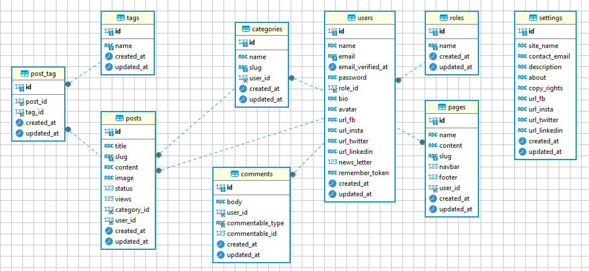
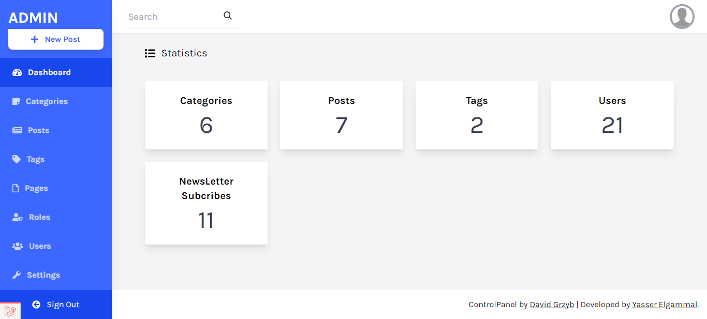
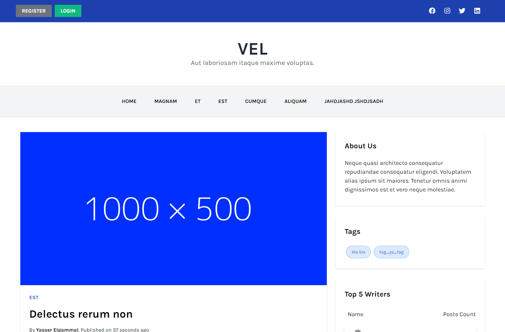
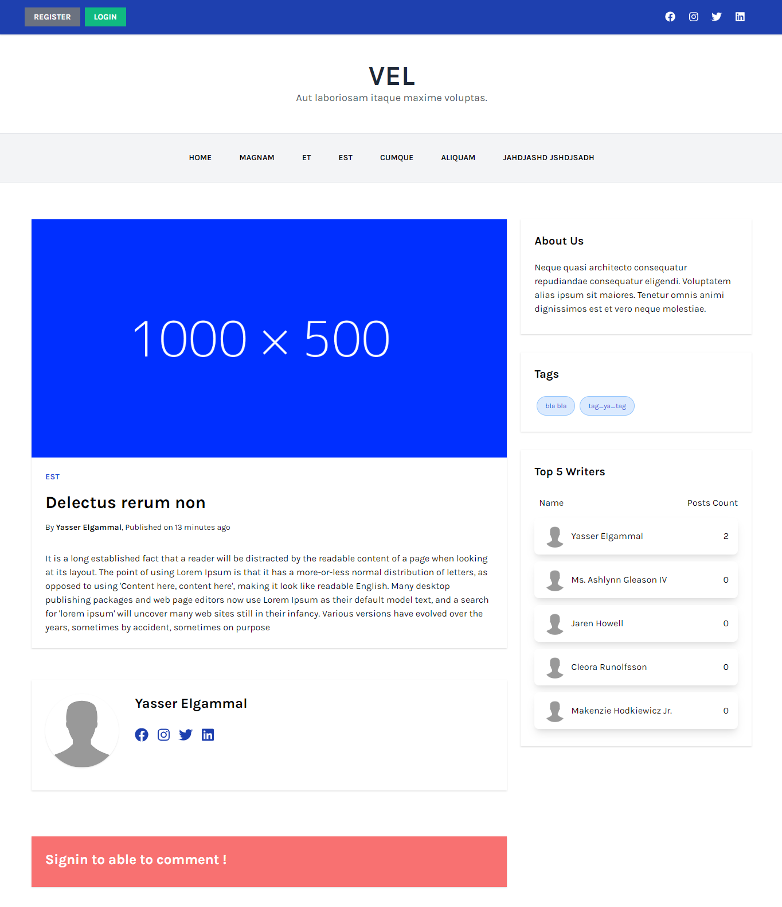

  

### Project Description
This is a **CMS Blog built with Laravel**.  
It includes a full-featured control panel with user role management.  

🎥 [Recorded Video Demo](https://youtu.be/HUvpQ2WR9rg "Recorded Video for the whole project")  
📅 Recorded on **January 16, 2023** ⚠️ **Note:** The project has received many updates since this recording.

---

### Tech Stack & Features
- Laravel Framework 11  
- TailwindCSS (front & admin)  
- Laravel Policies & Gates  
- Laravel Mail  
- Laravel Queues (weekly Newsletter)  
- Custom Validation Rules  
- Comments (Polymorphic relationship)  
- One-to-Many & Many-to-Many relationships between models  
- Post Views Count using Cookies  
- Faker & Database Seeder  
- jQuery  
- SEO-friendly Slug URLs  

---

### Screenshots

#### Database Schema

#### Admin Panel

#### Writer Panel

#### Front Blog

#### Front Blog - Post View

---

### Project Functionality

#### Admin Panel
- Edit general blog information  
- Create / Update / Delete Categories, Posts, Tags, and Custom Pages  
- Manage Roles  

#### Writer Panel
- Create, Update, and Delete own Posts  
- Create, Update, and Delete Tags  

---

### Roles

| Role Name | Role_ID |
|-----------|---------|
| Admin     | 1       |
| Writer    | 2       |
| User      | 3       |

---

### Gate Function
A gate filter is applied when logging into the admin panel:  
- **Admin** → full access to manage the blog  
- **Writer** → limited functionality  

---

### API Routes

| Method | Endpoint              | Description                           |
|--------|-----------------------|---------------------------------------|
| GET    | api/categories        | Show all categories                   |
| GET    | api/categories/{id}   | Show all posts inside a category      |
| GET    | api/posts             | Show all posts                        |
| GET    | api/posts/{id}        | Show a specific post                  |

---

## Requirements
- PHP >= 8.2  
- MySQL (or another supported database)  
- Composer  
- NodeJS  

---

### Installation
1. Clone the project  
2. Run `composer install` and `npm install`  
3. Copy `.env.example` to `.env`  
4. Run `php artisan key:generate`  
5. Update database credentials in `.env`  
6. Run migrations: `php artisan migrate`  
   - Optionally, run `php artisan db:seed` to populate sample data with Faker  
7. Start the server: `php artisan serve`  

---

### Demo Account
- Admin URL: [http://127.0.0.1:8000/admin](http://127.0.0.1:8000/admin)  
- Email: `admin@example.com`  
- Password: `password`  

---

## About Me

I am a Backend Developer with 3+ years of experience, specializing in PHP and the Laravel framework. I have expertise in building RESTful APIs, working with MySQL databases, and applying software architecture patterns such as MVC and HMVC.  

I also have experience with TailwindCSS for modern, responsive styling and Laravel Livewire for building dynamic, reactive user interfaces. I am committed to writing clean, well-documented, and maintainable code while continuously improving my skills.  

I enjoy sharing knowledge through various channels, and I’m always eager to take on new challenges to grow both personally and professionally.  

- [LinkedIn](https://www.linkedin.com/in/elgammal)  
- [YouTube](https://www.youtube.com/@yasser.elgammal)  
- [Dev.to](https://dev.to/yasserelgammal)  

---

## Contributing

Contributions are always welcome! 🎉  
If you’d like to improve this project, feel free to fork the repo and open a pull request.  
